# CSCS HPC Storage Proxy

## Overview

The **CSCS HPC Storage Proxy** is a specialized middleware application designed to bridge the gap between **Waldur Mastermind** (a cloud brokerage platform) and high-performance computing (HPC) storage systems (like Lustre or GPFS).

Its primary function is to:

1. **Fetch** abstract storage resource definitions from Waldur.
2. **Enrich** them with low-level identity data (Unix UIDs/GIDs) from an internal HPC User API.
3. **Transform** the data into a strict, hierarchical JSON format required by storage backend provisioners.
4. **Calculate** filesystem quotas based on business logic.

## Architecture

The application is built on **FastAPI** and operates as a stateless translation layer.


---

## 3. Installation

### Prerequisites

* Python 3.11+
* Access to a Waldur Mastermind instance.
* Access to the CSCS HPC User API (for GID resolution).
* A Keycloak/OIDC provider.

### Installation Steps

1. **Install via Pip**:

    ```bash
    pip install waldur-cscs-hpc-storage
    ```

2. **Or Install from Source**:

    ```bash
    git clone https://github.com/waldur/waldur-cscs-hpc-storage.git
    cd waldur-cscs-hpc-storage
    pip install .
    ```

---

## 4. Configuration

The application uses **Pydantic Settings**. Configuration is loaded in the following priority order:

1. **Environment Variables** (Highest priority)
2. **YAML Configuration File** (If `WALDUR_CSCS_STORAGE_PROXY_CONFIG_PATH` is set)
3. **Default Values**

### 4.1. Configuration Methods

**Method A: YAML (Recommended)**
Point to your file:

```bash
export WALDUR_CSCS_STORAGE_PROXY_CONFIG_PATH="/etc/waldur-cscs-proxy/config.yaml"
```

**Method B: Environment Variables**
Directly set variables in the environment (e.g., via Docker Compose or Kubernetes Secrets).

### 4.2. Detailed Configuration Reference

#### A. General Settings

| YAML Key          | Env Variable      | Type | Default      | Description                                                           |
| :---------------- | :---------------- | :--- | :----------- | :-------------------------------------------------------------------- |
| `debug`           | `DEBUG`           | Bool | `False`      | Enables verbose logging.                                              |
| `storage_systems` | `STORAGE_SYSTEMS` | Dict | **Required** | Maps the API `storage_system` parameter to Waldur **Offering Slugs**. |

**Example:**

```yaml
storage_systems:
  capstor: "cscs-capstor-offering"
  vast: "cscs-vast-offering"
```

#### B. Waldur API (Source of Truth)

| YAML Key                  | Env Variable         | Default      | Description                                        |
| :------------------------ | :------------------- | :----------- | :------------------------------------------------- |
| `waldur_api.api_url`      | `WALDUR_API_URL`     | **Required** | Full URL to Waldur API.                            |
| `waldur_api.access_token` | `WALDUR_API_TOKEN`   | **Required** | Token for a Service Provider user in Waldur.       |
| `waldur_api.verify_ssl`   | `WALDUR_VERIFY_SSL`  | `True`       | Validate SSL certificates.                         |
| `waldur_api.socks_proxy`  | `WALDUR_SOCKS_PROXY` | `None`       | Optional SOCKS proxy (e.g., `socks5://host:port`). |

#### C. Authentication (Incoming Security)

Controls how clients authenticate *to this proxy*.

| YAML Key                  | Env Variable              | Default | Description                              |
| :------------------------ | :------------------------ | :------ | :--------------------------------------- |
| `auth.disable_auth`       | `DISABLE_AUTH`            | `False` | **DANGER**: Disables all auth. Dev only. |
| `auth.keycloak_url`       | `CSCS_KEYCLOAK_URL`       | `...`   | Base URL of Keycloak.                    |
| `auth.keycloak_realm`     | `CSCS_KEYCLOAK_REALM`     | `cscs`  | The Realm to validate tokens against.    |
| `auth.keycloak_client_id` | `CSCS_KEYCLOAK_CLIENT_ID` | `None`  | Optional validation of `aud` claim.      |

#### D. HPC User API (Identity Resolution)

Used to fetch Unix GIDs for projects. This service authenticates itself to the API using OIDC Client Credentials.

| YAML Key                        | Env Variable              | Description                                                                   |
| :------------------------------ | :------------------------ | :---------------------------------------------------------------------------- |
| `hpc_user_api.api_url`          | `HPC_USER_API_URL`        | Base URL of the User/GID service.                                             |
| `hpc_user_api.client_id`        | `HPC_USER_CLIENT_ID`      | Client ID for machine-to-machine auth.                                        |
| `hpc_user_api.client_secret`    | `HPC_USER_CLIENT_SECRET`  | Client Secret for machine-to-machine auth.                                    |
| `hpc_user_api.oidc_token_url`   | `HPC_USER_OIDC_TOKEN_URL` | Endpoint to fetch the machine token.                                          |
| `hpc_user_api.socks_proxy`      | `HPC_USER_SOCKS_PROXY`    | Specific SOCKS proxy for this connection.                                     |
| `hpc_user_api.development_mode` | -                         | If `True`, generates mock GIDs instead of crashing if the API is unreachable. |

#### E. Backend Logic (Quotas & Filesystem)

| YAML Key                                  | Default     | Description                                                  |
| :---------------------------------------- | :---------- | :----------------------------------------------------------- |
| `backend_settings.storage_file_system`    | `lustre`    | The string identifier returned in JSON (e.g., GPFS, LUSTRE). |
| `backend_settings.inode_base_multiplier`  | `1,000,000` | How many inodes per TB of storage.                           |
| `backend_settings.inode_soft_coefficient` | `1.33`      | Multiplier for Soft Quota.                                   |
| `backend_settings.inode_hard_coefficient` | `2.0`       | Multiplier for Hard Quota.                                   |

*Validation Rule:* `inode_hard_coefficient` must be greater than `inode_soft_coefficient`.

#### F. Sentry (Error Tracking)

| YAML Key                    | Env Variable                | Description                          |
| :-------------------------- | :-------------------------- | :----------------------------------- |
| `sentry.dsn`                | `SENTRY_DSN`                | The Sentry DSN URL.                  |
| `sentry.environment`        | `SENTRY_ENVIRONMENT`        | Tag (e.g., `production`).            |
| `sentry.traces_sample_rate` | `SENTRY_TRACES_SAMPLE_RATE` | 0.0 to 1.0 (Performance monitoring). |

---

## 5. Operational Logic

### 5.1. The Hierarchy Builder

The proxy does not just list projects. It reconstructs a directory tree based on Waldur metadata.

1. **Tenant (Top Level)**: Maps to the Waldur **Offering Provider**.
    * Path: `/{system}/{type}/{provider_slug}`
2. **Customer (Mid Level)**: Maps to the Waldur **Resource Customer**.
    * Path: `.../{provider_slug}/{customer_slug}`
3. **Project (Leaf Level)**: Maps to the Waldur **Resource Project**.
    * Path: `.../{customer_slug}/{project_slug}`

### 5.2. Identity Resolution (GID Fetching)

The proxy cannot create storage unless it knows the **Unix GID** associated with the project.

1. **Check Cache**: An in-memory cache stores GIDs (Key: Project Slug) to reduce API load.
2. **API Call**: If missing, calls `HPC_USER_API_URL/api/v1/export/waldur/projects`.
3. **Token Refresh**: Handles OIDC token lifecycle automatically (fetches new token 5 minutes before expiry).
4. **Error Handling**:
    * *Production Mode*: If GID is not found, the resource **fails to process** (raises `MissingIdentityError`).
    * *Development Mode*: Generates a deterministic mock GID (`30000 + hash(slug) % 10000`).

### 5.3. Quota Calculation Formula

Quotas are derived from the storage limit (in TB) set in Waldur.

1. **Base Inodes** = `Storage_TB` * `inode_base_multiplier`
2. **Soft Inode Limit** = `Base Inodes` * `inode_soft_coefficient`
3. **Hard Inode Limit** = `Base Inodes` * `inode_hard_coefficient`

*Note: Administrative overrides in Waldur (Resource Options) take precedence over these calculations.*

---

## 6. API Reference

### GET `/api/storage-resources/`

Retrieves the list of formatted storage resources.

**Headers:**

* `Authorization`: `Bearer <valid_oidc_token>`

**Query Parameters:**

| Parameter        | Type   | Required | Description                                             |
| :--------------- | :----- | :------- | :------------------------------------------------------ |
| `storage_system` | Enum   | No       | `capstor`, `vast`, or `iopsstor`. Filter by system.     |
| `data_type`      | Enum   | No       | `store`, `scratch`, `archive`, `users`. Filter by type. |
| `status`         | Enum   | No       | `active`, `pending`, `removing`, `error`.               |
| `state`          | String | No       | Filter by specific Waldur resource state (e.g., `OK`).  |
| `page`           | Int    | No       | Pagination page (default: 1).                           |
| `page_size`      | Int    | No       | Items per page (default: 100, max: 500).                |

**Response Format:**

```json
{
  "status": "success",
  "resources": [
    {
      "itemId": "uuid...",
      "status": "active",
      "mountPoint": { "default": "/capstor/store/cscs/customer/project" },
      "permission": { "value": "775", "permissionType": "octal" },
      "quotas": [
        { "type": "space", "quota": 10.0, "unit": "tera", "enforcementType": "hard" }
      ],
      "target": {
        "targetType": "project",
        "targetItem": {
            "name": "project-slug",
            "unixGid": 30500,
            "status": "active"
        }
      }
    }
  ],
  "pagination": { ... }
}
```

---

## 7. Troubleshooting

### Common Error Codes

| Error                           | Cause                             | Solution                                                                                |
| :------------------------------ | :-------------------------------- | :-------------------------------------------------------------------------------------- |
| **500 ConfigurationError**      | Application settings are invalid. | Check server logs. Usually missing Env Vars or invalid coefficient logic.               |
| **502 UpstreamServiceError**    | Cannot contact Waldur or HPC API. | Check `WALDUR_API_URL`, network, or SOCKS proxy settings.                               |
| **401 Unauthorized**            | Token missing or invalid.         | Ensure your Bearer token is from the correct Realm and has `preferred_username`.        |
| **500 ResourceProcessingError** | `MissingIdentityError`            | The project exists in Waldur but not in the HPC User API. Ensure the project is synced. |

### Debugging

Enable debug logging to see the full mapping flow and API exchanges:

```bash
export DEBUG=true
```

To test without Authentication (Local Dev Only):

```bash
export DISABLE_AUTH=true
export WALDUR_CSCS_STORAGE_PROXY_CONFIG_PATH=config_dev.yaml
uvicorn waldur_cscs_hpc_storage.api.main:app
```

### SOCKS Proxy Testing

If running behind a corporate firewall, ensure `httpx` (the underlying library used) can reach the SOCKS proxy.

```bash
export WALDUR_SOCKS_PROXY="socks5://localhost:1080"
```

Logs will indicate: `Using SOCKS proxy for API request...`

---

## 8. Integrator Guide

This section is for developers building **Storage Provisioners** (drivers) that consume this proxy's API.

### 8.1. Resource Lifecycle

The provisioner should run a reconciliation loop (e.g., every minute) that:

1. Calls to `GET /api/storage-resources/` to list all resources.
2. Iterates through the list and checks the `status` field.
3. Performs the necessary action (Create, Update, Delete) based on the status.
4. Reports back to Waldur via the `callback_url` (if provided) to finalize the state.

### 8.2. The 3-Step Provisioning Protocol

A complete provisioning flow involves three distinct callbacks to Waldur. This ensures the Order transitions correctly through its state machine:

1. **Approve/Reject** (`approve_by_provider_url`):
    * **When**: Order is in `PENDING_PROVIDER` state.
    * **Purpose**: Acknowledges the request. Moves Order to `EXECUTING`.
2. **Set State Done** (`set_state_done_url`):
    * **When**: Order is in `EXECUTING` state (provisioning finished).
    * **Purpose**: Confirms the work is complete. Moves Order to `DONE`.
3. **Set Backend ID** (`set_backend_id_url`):
    * **When**: Order is in `DONE` state (or `EXECUTING`).
    * **Purpose**: Links the Waldur resource to the specific backend identifier.

**Note**: You can send `set_backend_id` earlier (during `EXECUTING`), but `set_state_done` **must** be called to finalize the order.

### 8.3. The Create Flow

**Trigger**: A user creates a resource in Waldur.
**Proxy Status**: `pending`

The JSON payload will look like this:

```json
{
  "itemId": "uuid-1234",
  "status": "pending",
  "quotas": [
      { "type": "space", "quota": 10.0, "unit": "tera", "enforcementType": "hard" },
      { "type": "inodes", "quota": 10000000, "unit": "none", "enforcementType": "hard" }
  ],
  "target": {
    "targetType": "project",
    "targetItem": {
        "unixGid": 30500,
        "name": "project-slug"
    }
  },
  "approve_by_provider_url": "https://waldur.example.com/api/marketplace-orders/uuid/approve_by_provider/",
  "reject_by_provider_url": "https://waldur.example.com/api/marketplace-orders/uuid/reject_by_provider/",
  "set_state_done_url": "https://waldur.example.com/api/marketplace-orders/uuid/set_state_done/",
  "set_backend_id_url": "https://waldur.example.com/api/marketplace-orders/uuid/set_backend_id/"
}
```

**Action**:

1. Create the filesystem directory/fileset.
2. Set the Quotas (Space & Inodes from `quotas`).
3. Set the Ownership (GID from `target.targetItem.unixGid`).
4. **POST** to `approve_by_provider_url` (empty body) to signal completion.

Once approved, the resource state in Waldur becomes `OK`, and the proxy status becomes `active`.

### 8.4. The Update Flow

**Trigger**: A user changes the storage limit in Waldur.
**Proxy Status**: `updating`

The proxy provides both `oldQuotas` (current state) and `newQuotas` (desired state).

```json
{
  "itemId": "uuid-1234",
  "status": "updating",
  "quotas": [ ... ],
  "oldQuotas": [
      { "type": "space", "quota": 10.0, "unit": "tera", "enforcementType": "hard" }
  ],
  "newQuotas": [
      { "type": "space", "quota": 20.0, "unit": "tera", "enforcementType": "hard" }
  ],
  "approve_by_provider_url": "https://waldur.example.com/api/marketplace-orders/uuid/approve_by_provider/",
  "reject_by_provider_url": "https://waldur.example.com/api/marketplace-orders/uuid/reject_by_provider/",
  "set_state_done_url": "https://waldur.example.com/api/marketplace-orders/uuid/set_state_done/",
}
```

**Action**:

1. Apply the new quotas from `newQuotas`.
2. **POST** to `set_state_done_url` to confirm the update.

### 8.5. The Terminate Flow

**Trigger**: A user deletes the resource in Waldur.
**Proxy Status**: `removing`

```json
{
  "itemId": "uuid-1234",
  "status": "removing",
  "approve_by_provider_url": "https://waldur.example.com/api/marketplace-orders/uuid/approve_by_provider/",
  "reject_by_provider_url": "https://waldur.example.com/api/marketplace-orders/uuid/reject_by_provider/",
  "set_state_done_url": "https://waldur.example.com/api/marketplace-orders/uuid/set_state_done/",
}
```

**Action**:

1. Archive or delete the data on the filesystem.
2. Remove any configuration.
3. **POST** to `set_state_done_url`.

### 8.6. Detailed Waldur Workflow

To better understand the lifecycle, it helps to know the underlying Waldur states.

#### Order States

Orders progress through a carefully managed state machine with approval workflows:

```mermaid
stateDiagram-v2
    [*] --> PENDING_CONSUMER : Order created

    PENDING_CONSUMER --> PENDING_PROVIDER : Consumer approves
    PENDING_CONSUMER --> PENDING_PROJECT : Consumer approves & project start date is future
    PENDING_CONSUMER --> PENDING_START_DATE : Consumer approves & no provider review & order start date is future
    PENDING_CONSUMER --> CANCELED : Consumer cancels
    PENDING_CONSUMER --> REJECTED : Consumer rejects

    PENDING_PROVIDER --> PENDING_START_DATE : Provider approves & order start date is future
    PENDING_PROVIDER --> EXECUTING : Provider approves
    PENDING_PROVIDER --> CANCELED : Provider cancels
    PENDING_PROVIDER --> REJECTED : Provider rejects

    PENDING_PROJECT --> PENDING_PROVIDER: Project activates & provider review needed
    PENDING_PROJECT --> PENDING_START_DATE: Project activates & no provider review & order start date is future
    PENDING_PROJECT --> EXECUTING: Project activates
    PENDING_PROJECT --> CANCELED : Project issues

    PENDING_START_DATE --> EXECUTING : Start date reached
    PENDING_START_DATE --> CANCELED : User cancels

    EXECUTING --> DONE : Processing complete
    EXECUTING --> ERRED : Processing failed

    DONE --> [*]
    ERRED --> [*]
    CANCELED --> [*]
    REJECTED --> [*]
```



#### Order State Descriptions

| State | Description | Triggers |
|-------|-------------|----------|
| **PENDING_CONSUMER** | Awaiting customer approval | Order creation |
| **PENDING_PROVIDER** | Awaiting service provider approval | Consumer approval |
| **PENDING_PROJECT** | Awaiting project activation | Provider approval |
| **PENDING_START_DATE** | Awaiting the order's specified start date. | Activation when a future start date is set on the order. |
| **EXECUTING** | Resource provisioning in progress | Processor execution |
| **DONE** | Order completed successfully | Resource provisioning success |
| **ERRED** | Order failed with errors | Processing errors |
| **CANCELED** | Order canceled by user/system | User cancellation |
| **REJECTED** | Order rejected by provider | Provider rejection |

#### Resource States

Resources maintain their own lifecycle independent of orders:


#### Resource State Descriptions

| State | Description | Operations Allowed |
|-------|-------------|-------------------|
| **CREATING** | Resource being provisioned | Monitor progress |
| **OK** | Resource active and healthy | Update, delete, use |
| **UPDATING** | Resource being modified | Monitor progress |
| **TERMINATING** | Resource being deleted | Monitor progress |
| **TERMINATED** | Resource deleted | Archive, billing |
| **ERRED** | Resource in error state | Retry, investigate, delete |
